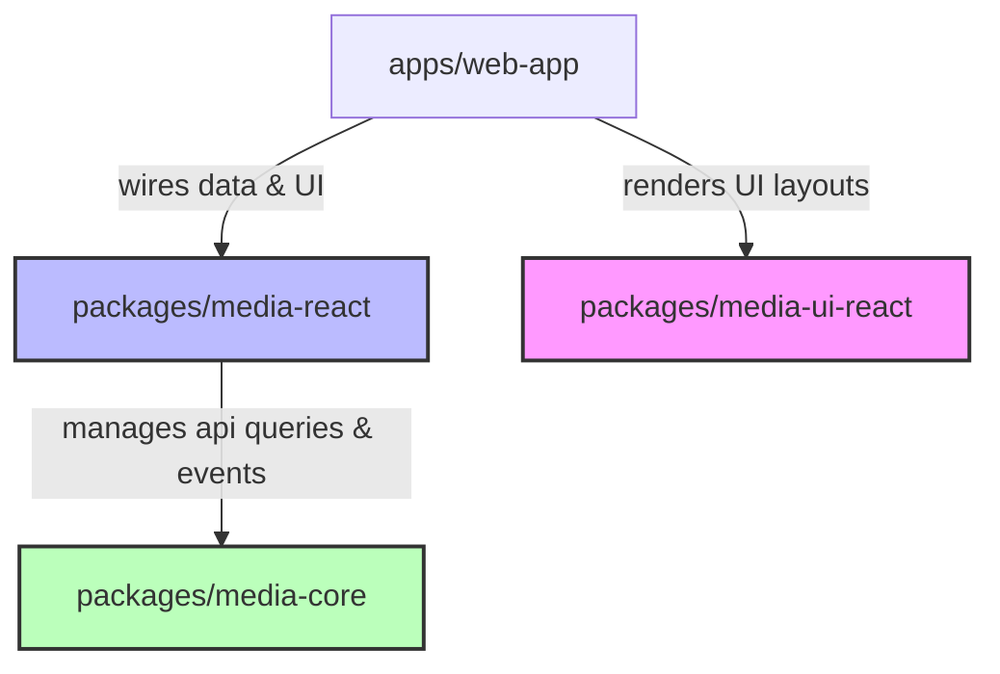

# Headless Media SDK Ecosystem & Component Library

This monorepo implements a complete headless media SDK ecosystem consisting of a core SDK (`media-core`), platform-specific React and React Native wrappers (`media-react`, `media-native`), platform-specific headless UI components (`media-ui-react`, `media-ui-native`), and a responsive web application (`web-app`) demonstrating the system.

## 🚀 Getting Started

To run the project locally, follow these steps:

1. **Install dependencies** in the root workspace:
   ```bash
   npm install
   ```
2. **Build all packages** (compiles TypeScript modules into ESM formats):
   ```bash
   npm run build
   ```
3. **Start the development server** for the React Web App:
   ```bash
   npm run dev
   ```
4. Open your browser to [http://localhost:3000](http://localhost:3000).

---

## 📁 Repository Structure & Workspaces

The project is structured as an npm workspaces monorepo:

* **`/packages/media-core/`**: Framework-agnostic pure TypeScript client for the Pexels API. Features built-in GET cache, request de-duplication, and an event emitter for tracking user interactions.
* **`/packages/media-react/`**: Thin wrapper around `media-core` providing a `<MediaProvider />` context and hooks for query state, pagination, and events (`useMediaSearch`, `useMediaCurated`, `useMediaEvents`).
* **`/packages/media-native/`**: Thin wrapper adapting `media-core` to React Native context and layout interfaces.
* **`/packages/media-ui-react/`**: Pure UI headless web hooks (`useHeadlessGrid`, `useHeadlessLightbox`, `useHeadlessReelSwiper`) providing prop-getters and accessibility configurations.
* **`/packages/media-ui-native/`**: Pure UI headless React Native hooks for FlatList and ScrollView.
* **`/apps/web-app/`**: Sleek, glassmorphic React (Vite + TS) dashboard utilizing the libraries.

---

## 🏗️ Architecture & Constraints

As required by the specification, strict architectural boundaries are maintained:



* **Dependency Flow**: `app → wrappers → core` and `app → components`.
* **Isolation**:
  * Wrappers (`media-react` / `media-native`) and Component Libraries (`media-ui-react` / `media-ui-native`) are **100% independent** and never import each other.
  * Component Libraries contain **no business logic** and are completely unaware of the SDK, wrappers, or the Pexels API. They receive lists and callbacks purely as props and return accessible prop-getters.
  * Core SDK is 100% portable with **zero DOM or UI framework imports**, making it fully compatible with any platform, CLI, or server.

---

## 💎 Features & Custom Logic

### 1. In-Memory Cache & Request De-duplication
`MediaCoreClient` includes a request de-duplication map. If two identical requests (e.g. page 1 of curated photos) are fired in-flight concurrently, the client merges them into a single promise. Successful requests are cached for 5 minutes (TTL configurable).

### 2. SDK Activity Event Emitter
The SDK exposes an activity emitter supporting subscribe and unsubscribe patterns. 
* By default, a console logger is attached to the client during instantiation, printing every event.
* The React wrapper (`useMediaEvents`) lets developers subscribe and tap into the stream (e.g. to display a real-time event monitor, as shown in the web app's left sidebar).
* Tracking actions include:
  * `trackView(mediaId, mediaType, url, title)`
  * `trackDownload(mediaId, mediaType, url, title)`

### 3. Accessible Headless Lightbox
* **Focus Trapping**: Tabbing in the open lightbox wraps focus between the controls (prev, close, next, download) and prevents focus from escaping into the underlying grid.
* **Keyboard Navigation**: Native key down listener captures `Escape` to close, and `ArrowLeft` / `ArrowRight` to paginate slides.
* **Restored Focus**: Closing the lightbox automatically restores browser focus to the grid item card that originally triggered it.

### 4. Snap-Scroll Reels Swiper
The Reels Swiper provides vertical snapping slides similar to modern social feeds:
* Uses standard CSS scroll snap (`scroll-snap-type: y mandatory`).
* Employs an `IntersectionObserver` on the viewport to detect which slide is currently filling > 60% of the screen.
* Triggers active slide detection dynamically, automatically playing the active video, muting inactive videos, and firing SDK `view` events.

---

## 🤖 AI Coding Assistant Skills

We've shipped two standard `.md` instruction documents for AI coding tools:
* **[SKILL_WIRING.md](file:///c:/Users/perwe/Downloads/React_Task/SKILL_WIRING.md)**: Guides assistants on setting up provider context, loading data hooks, paginating feeds, and dispatching event listeners.
* **[SKILL_COMPONENTS.md](file:///c:/Users/perwe/Downloads/React_Task/SKILL_COMPONENTS.md)**: Instructs assistants on building headless layouts, binding returned prop-getters to JSX elements, managing accessibility, and hooking up scroll snaps.
